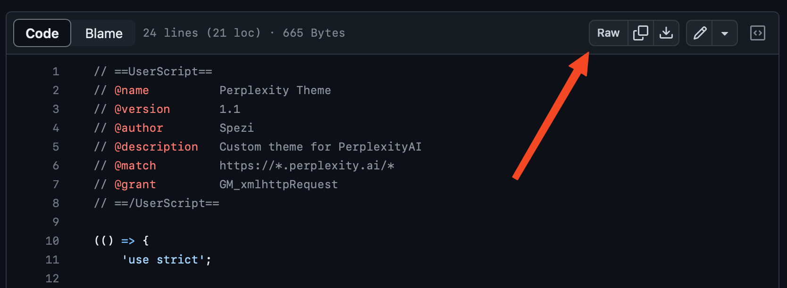
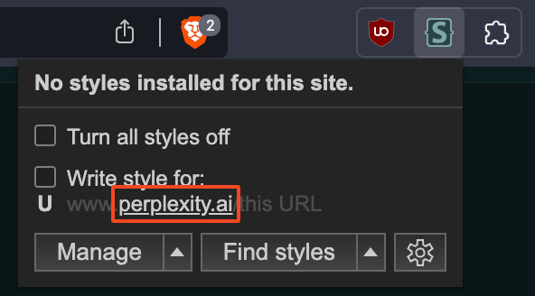

# CSS Themes
This repository contains custom CSS themes for websites. These themes can be used to customize the appearance of web pages. Feel free to explore and use these themes.

## Auto update installation (recommended)
This method is recommended since it will automatically keep the themes up to date. For this to work you need **one** of the following extensions:
- Tampermonkey ([Chromium](https://chrome.google.com/webstore/detail/tampermonkey/dhdgffkkebhmkfjojejmpbldmpobfkfo)/ [Firefox](https://addons.mozilla.org/en-US/firefox/addon/tampermonkey/))
- Violentmonkey ([Chromium](https://chrome.google.com/webstore/detail/violentmonkey/jinjaccalgkegednnccohejagnlnfdag)/ [Firefox](https://addons.mozilla.org/en-US/firefox/addon/violentmonkey/?utm_source=addons.mozilla.org&utm_medium=referral&utm_content=search))
- Userscripts ([Safari](https://apps.apple.com/us/app/userscripts/id1463298887), also works on IOS)

Once installed navigate to the theme you want to install on this github and click on the `themeName.user.js` file. At the top of the file you'll see a `Raw` button that you need to click (see image). You'll then be prompted to install the script.

Reload the website and you should see the new theme.

With the userscripts extension on safari you'll have to click on the extension icon and then click on the install button. ([Video tutorial](https://youtu.be/x1r3-L7pdYQ?t=14))

## Manual installation
### Chromium/ Firefox Browser
- Install the Stylus ([Chromium](https://chrome.google.com/webstore/detail/stylus/clngdbkpkpeebahjckkjfobafhncgmne)/ [Firefox](https://addons.mozilla.org/en-US/firefox/addon/styl-us/)) extension
- Go to the website and click on the middle part of the url (see image below)
- A new page will open where you can put in the content of the CSS file
- Now save the file on the top left
- Refresh the website to see the result
(Please watch [this official tutorial](https://www.youtube.com/watch?v=fCVvGwoF5cQ) if you're having difficulties installing the theme)

### Safari
Please watch this [video tutorial](https://youtu.be/x1r3-L7pdYQ?t=14). You'll just have to copy and paste the content of the `theme.css` into the extension and it should work.
